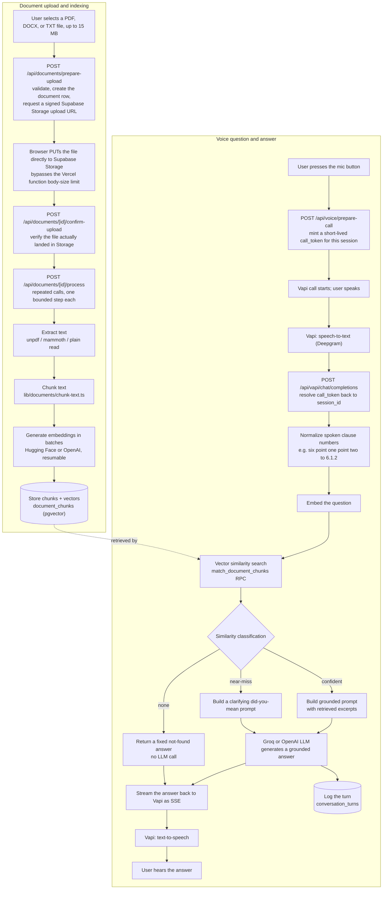

## Architecture: the RAG pipeline

Files are uploaded directly from the browser to Supabase Storage (not routed through a Vercel serverless function), and large documents are indexed across many short, resumable processing steps rather than one long request. For the complete, step-by-step breakdown of every file, route, and service involved in both flows — see **[pipeline.md](./pipeline.md)**.

Retrieval is grounded: if nothing relevant is found in the user's own documents, the LLM is never called and DocTalk says so plainly instead of guessing. See `lib/rag/prompt.ts` for the similarity-threshold logic behind the confident / near-miss / none classification, and `lib/rag/normalize-spoken-numbers.ts` for how spoken clause/section references (e.g. "six point one point two") are converted to digit form ("6.1.2") before the question is embedded, so retrieval isn't thrown off by how voice transcription renders numbers.
